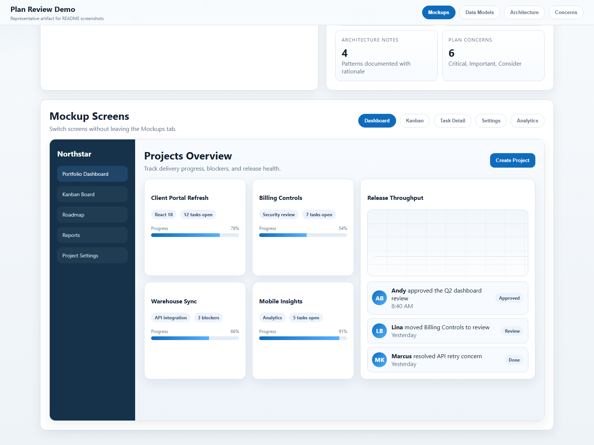
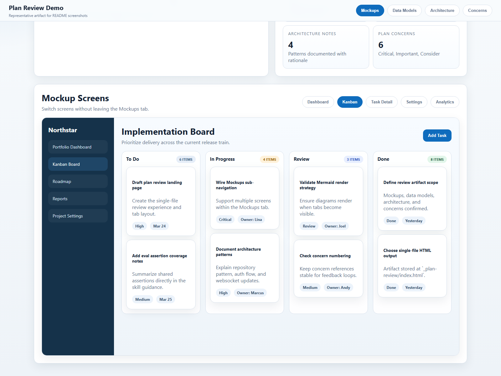
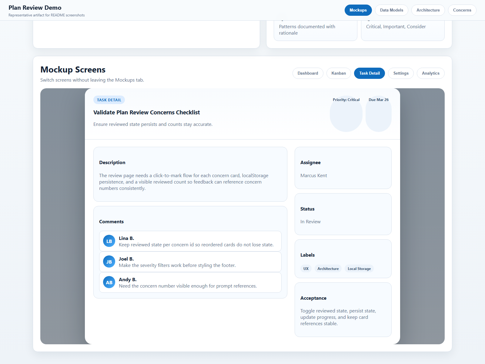
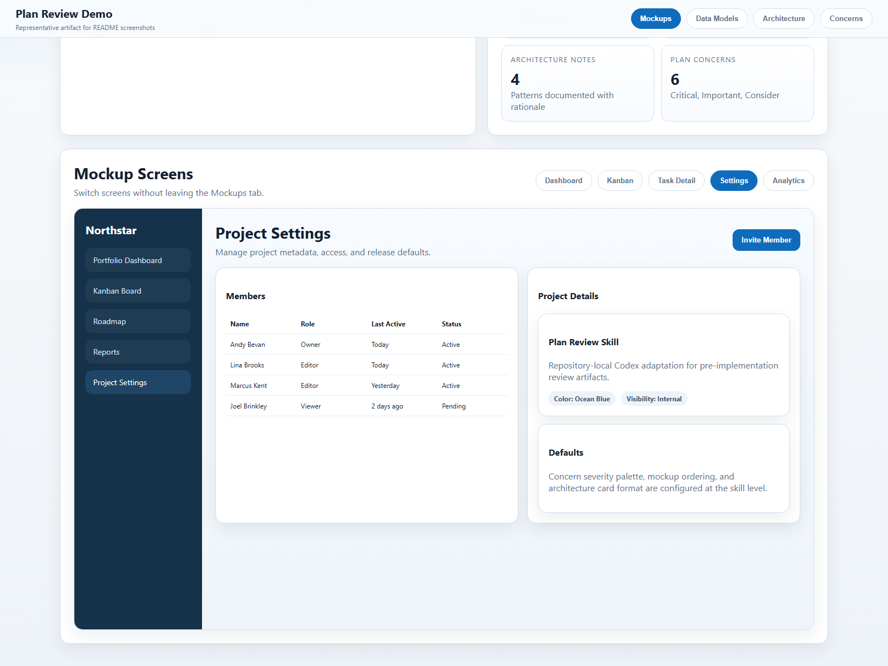
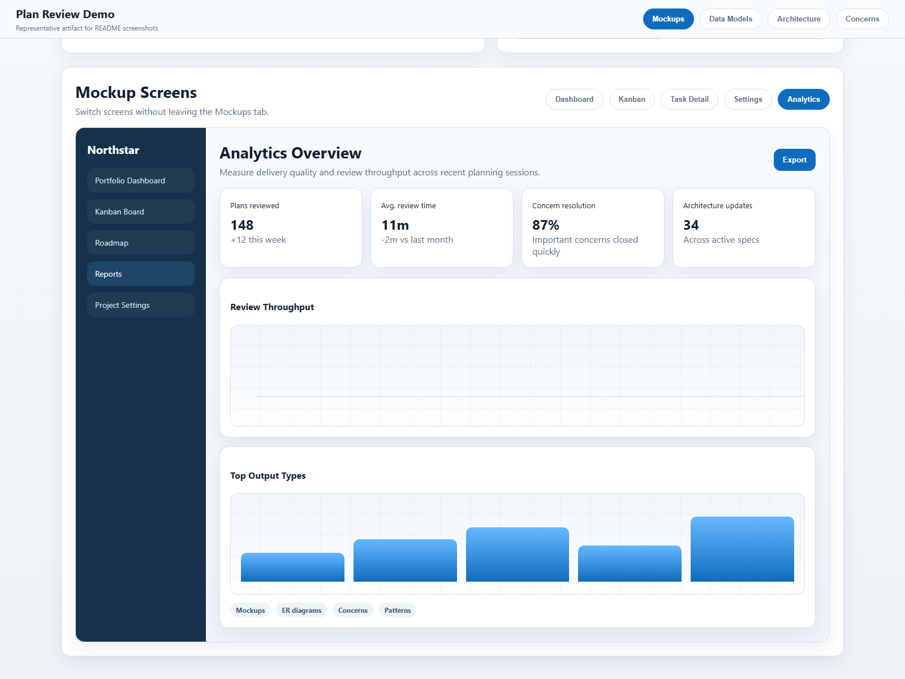
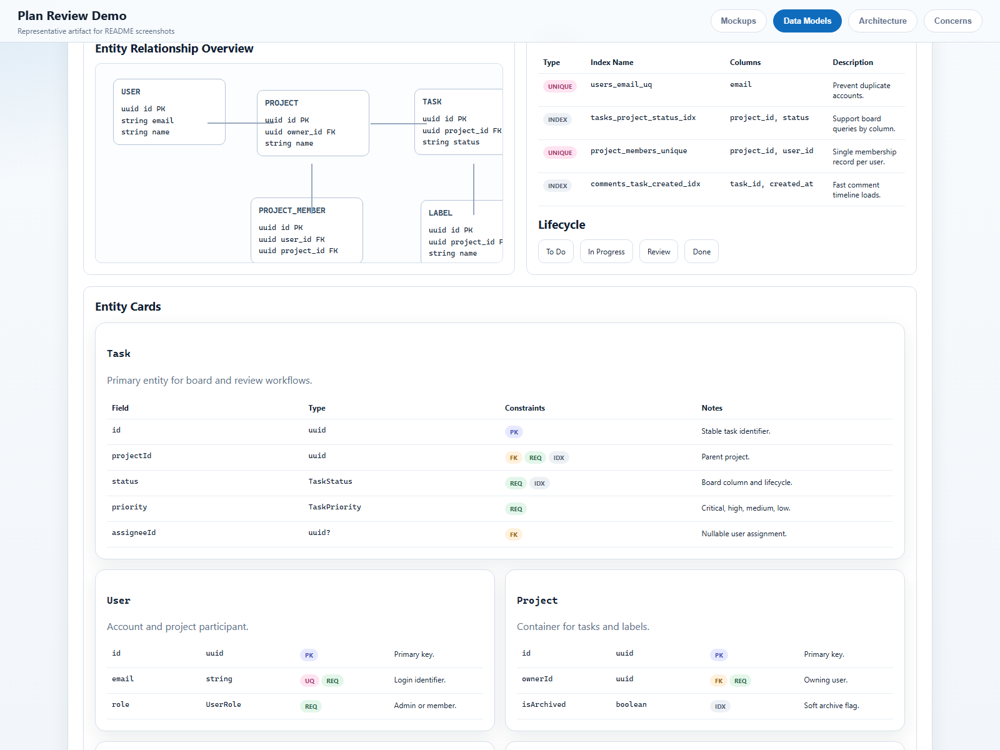
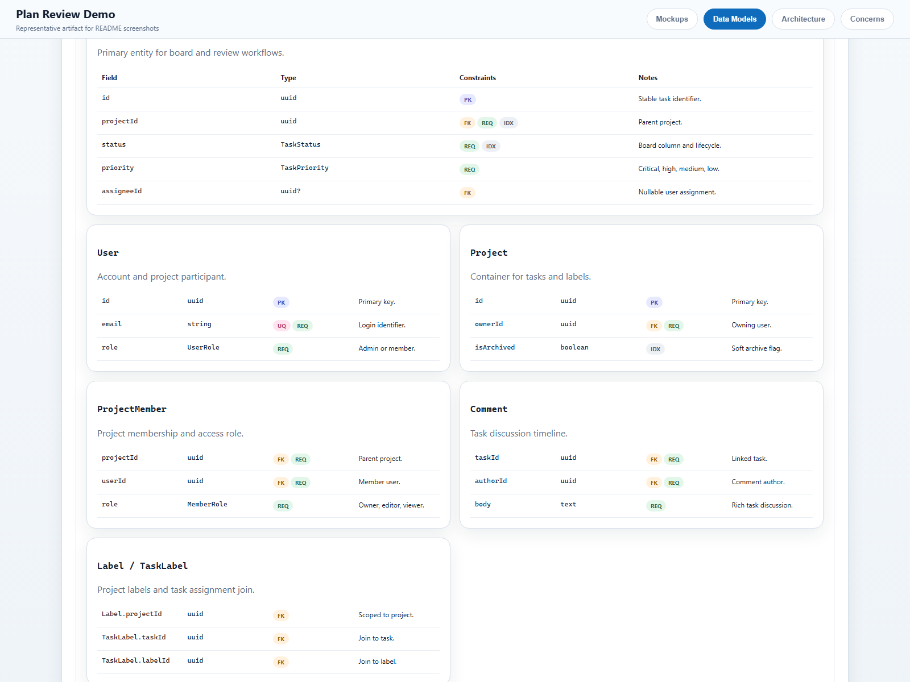
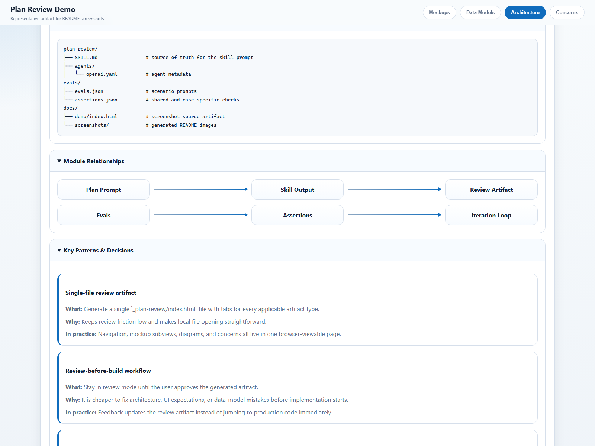
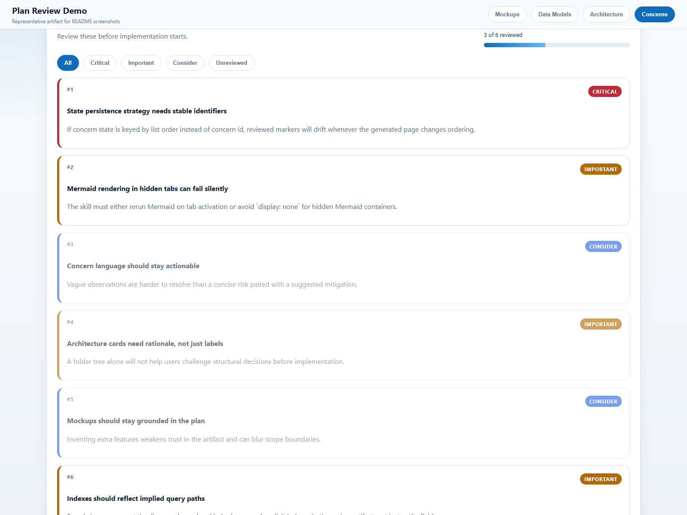

# plan-review-skill-codex

A [Codex](https://openai.com/codex/) skill that generates visual, browser-viewable review artifacts from a plan before implementation begins.

See the proposed build before implementation starts.

## What it generates

After planning a feature or app, this skill produces a single-page review app (`_plan-review/index.html`) with up to four tabs. Only applicable tabs are shown, so an API-only plan skips Mockups automatically.

### Mockups

High-fidelity HTML/CSS screens intended to set implementation expectations early.





<details>
<summary>More mockup examples</summary>

**Task Detail Modal** - full task view with comments, labels, priority, and assignee:



**Project Settings** - member management and project metadata:



**Analytics Dashboard** - KPI cards, charts, and recent activity:



</details>

### Data Models

Mermaid-style ER overviews, dense entity cards, enums, indexes, lifecycle flows, and design notes.





### Architecture

Annotated folder structure, module relationship diagrams, and pattern cards explaining the reasoning behind structural choices.



### Concerns

An interactive checklist of risks, gaps, and tradeoffs, organized by severity and intended for review before implementation starts.



## Installation

Codex skills are typically discovered from `$CODEX_HOME/skills` or `~/.codex/skills`.

Choose one:

- `Global copy`: copy [plan-review](C:/DevGit/AndyBevan/AI-Codex/plan-review-skill-codex/plan-review) into your Codex skills directory.
- `Global link`: symlink [plan-review](C:/DevGit/AndyBevan/AI-Codex/plan-review-skill-codex/plan-review) into your Codex skills directory if you want live edits from this repo.
- `Project-local copy`: install into `.codex/skills/plan-review` inside this repo.

Helper scripts:

```text
Project-local
  ./scripts/install-skill-project.sh
  .\scripts\install-skill-project.ps1

Global
  ./scripts/install-skill-global.sh
  .\scripts\install-skill-global.ps1
```

The global scripts respect `CODEX_HOME` when set; otherwise they use the default Codex location. If you are actively editing the skill, prefer a global symlink over copying.

## Usage

Trigger the skill explicitly:

```text
$plan-review
```

Or ask naturally:

- "review the plan"
- "show me what we're building"
- "let me see the mockups"
- "hold on, let me see this first"

## How it works

```text
Plan a feature      Run $plan-review      Review in browser      Iterate
with Codex     ->   generates index.html -> mockups, models, -> give feedback,
                                           architecture,       update review
                                           concerns
```

1. Plan the feature in conversation.
2. Run `$plan-review` and let the skill generate `_plan-review/index.html`.
3. Review the output in a browser and iterate on the design.
4. Start implementation only after the review looks right.

The `_plan-review/` directory is intended for generated artifacts and is ignored by git in this repository.

## What makes the output good

- Realistic content instead of placeholders
- Complete data-model coverage with fields, types, constraints, enums, and indexes
- Browser-viewable review artifacts in a single file
- Actionable concerns that surface likely rework before implementation starts
- Dense, developer-friendly presentation instead of presentation-deck styling

## Repository Layout

- `plan-review/SKILL.md`: source of truth for the skill behavior
- `plan-review/agents/openai.yaml`: skill metadata
- `evals/evals.json`: example prompts
- `evals/assertions.json`: shared and scenario-specific checks
- `docs/demo/index.html`: local demo artifact used to capture README screenshots
- `docs/capture-screenshots.ps1`: Playwright capture script for regenerating screenshots
- `scripts/install-skill-project.ps1`: PowerShell helper for project-local installation
- `scripts/install-skill-project.sh`: shell helper for project-local installation
- `scripts/install-skill-global.ps1`: PowerShell helper for global installation
- `scripts/install-skill-global.sh`: shell helper for global installation

## Refreshing screenshots

The screenshots in `docs/screenshots/` are generated locally from `docs/demo/index.html` with Playwright.

```powershell
powershell -ExecutionPolicy Bypass -File .\docs\capture-screenshots.ps1
```

## Credits

This Codex adaptation is based on the original Claude version `plan-review` project by [Joel Brinkley](https://github.com/joelbrinkley) (`@joelbrinkley`).

Original repository: https://github.com/joelbrinkley/plan-review-skill
